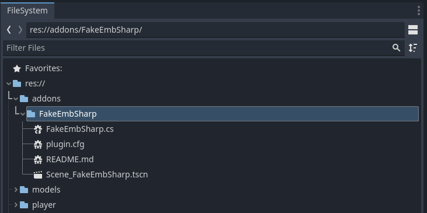
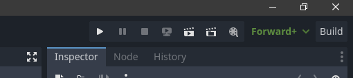
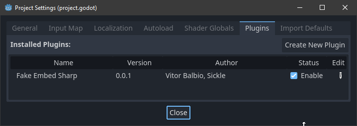
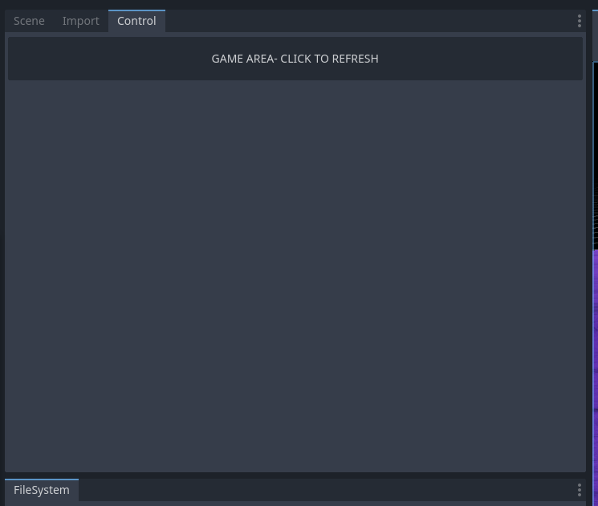

# FakeEmbSharp
Allows docking the Godot game window within the editor window (Godot 4, C#)
Uses the windows API to parent the game window to the editor window.

## Limitations:
It's a proof of concept, it's not been well tested, expect bugs.
Windows only, don't try to float the dock out! (Especailly in single window mode)

## Installation

Copy the FakeEmbSharp folder to e.g.
c:\myproject\addons\FakeEmbSharp

Hit the wee build button:

Go to 
`Project` -> `Project Settings` -> `Plugins` (tab):
And enable the plugin.

A new dock should appear:
Open it, move it somewhere.

## What do?

Hit play

